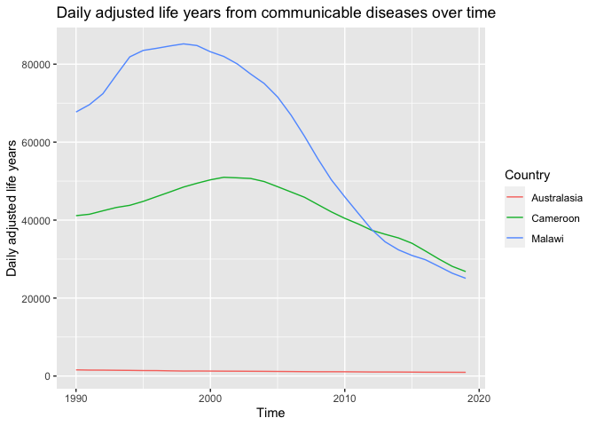

------------------------------------------------------------------------

title: “Communicable, Maternal, Neonatal, and Nutritional Disease Burden
(CMNN)” author: “Alyssa Pradhan” output: github_document

------------------------------------------------------------------------

# Communicable, Maternal, Neonatal, and Nutritional Disease Burden (CMNN)

## Table of Estimates for CMNN Burden Over Time

DALY by year for each of Australasia, Cameroon and Malawi

| Year | Australasia | Cameroon |   Malawi |
|-----:|------------:|---------:|---------:|
| 1990 |   1585.2174 | 41138.97 | 67720.68 |
| 1991 |   1530.2590 | 41501.22 | 69611.68 |
| 1992 |   1517.9832 | 42386.18 | 72425.84 |
| 1993 |   1484.2005 | 43239.73 | 77205.15 |
| 1994 |   1457.4529 | 43789.90 | 81870.48 |
| 1995 |   1411.3279 | 44802.07 | 83523.82 |
| 1996 |   1402.7190 | 46026.84 | 84066.40 |
| 1997 |   1338.1343 | 47234.92 | 84671.35 |
| 1998 |   1286.5799 | 48478.10 | 85203.76 |
| 1999 |   1296.4371 | 49450.97 | 84775.65 |
| 2000 |   1280.1081 | 50332.81 | 83179.92 |
| 2001 |   1258.6153 | 50983.40 | 81972.65 |
| 2002 |   1247.2190 | 50842.00 | 80059.14 |
| 2003 |   1228.0596 | 50674.60 | 77454.71 |
| 2004 |   1212.0887 | 49887.67 | 75049.23 |
| 2005 |   1185.0499 | 48568.37 | 71586.95 |
| 2006 |   1161.6451 | 47215.00 | 66929.50 |
| 2007 |   1129.9953 | 45860.13 | 61515.38 |
| 2008 |   1107.2900 | 43976.64 | 55699.27 |
| 2009 |   1108.9957 | 42111.32 | 50335.60 |
| 2010 |   1100.8148 | 40455.95 | 45957.25 |
| 2011 |   1074.0344 | 39016.70 | 41755.34 |
| 2012 |   1043.9431 | 37393.81 | 37589.36 |
| 2013 |   1040.7410 | 36368.89 | 34434.73 |
| 2014 |   1030.3656 | 35419.80 | 32365.33 |
| 2015 |   1011.8034 | 34056.23 | 30933.41 |
| 2016 |    987.0032 | 32069.77 | 29834.47 |
| 2017 |    979.7083 | 30020.81 | 28119.98 |
| 2018 |    969.1878 | 28132.24 | 26372.76 |
| 2019 |    957.5732 | 26802.97 | 25068.66 |

## Plot Showing Trends in CMNN Burden Over Time

<!-- -->

## Summary of CMNN Burden Findings

This data demonstrates that in Malawi and Cameroon there was an initial
increase in DALY in the late 1990s and early 2000s, possibly due to the
HIV/AIDs epidemic. This has reduced since the 2010s. The DALYs lost in
Australia from communicable disease has generally been low.
