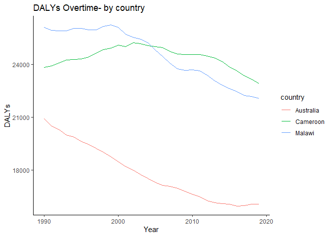

Non-Communicable Disease Burden (NCD)
================
Clement Trapence

## Table of Estimates for NCD Burden Over Time

| country   | country_code | Year |    DALYs |
|:----------|:-------------|-----:|---------:|
| Australia | AUS          | 1990 | 20910.31 |
| Australia | AUS          | 1991 | 20483.92 |
| Australia | AUS          | 1992 | 20294.06 |
| Australia | AUS          | 1993 | 19978.86 |
| Australia | AUS          | 1994 | 19876.85 |
| Australia | AUS          | 1995 | 19624.51 |
| Australia | AUS          | 1996 | 19461.13 |
| Australia | AUS          | 1997 | 19233.22 |
| Australia | AUS          | 1998 | 18992.07 |
| Australia | AUS          | 1999 | 18740.97 |
| Australia | AUS          | 2000 | 18467.31 |
| Australia | AUS          | 2001 | 18181.01 |
| Australia | AUS          | 2002 | 17997.19 |
| Australia | AUS          | 2003 | 17746.36 |
| Australia | AUS          | 2004 | 17522.61 |
| Australia | AUS          | 2005 | 17302.04 |
| Australia | AUS          | 2006 | 17112.47 |
| Australia | AUS          | 2007 | 17053.32 |
| Australia | AUS          | 2008 | 16955.95 |
| Australia | AUS          | 2009 | 16788.48 |
| Australia | AUS          | 2010 | 16625.33 |
| Australia | AUS          | 2011 | 16480.76 |
| Australia | AUS          | 2012 | 16255.88 |
| Australia | AUS          | 2013 | 16133.95 |
| Australia | AUS          | 2014 | 16086.16 |
| Australia | AUS          | 2015 | 16053.35 |
| Australia | AUS          | 2016 | 15950.46 |
| Australia | AUS          | 2017 | 15976.50 |
| Australia | AUS          | 2018 | 16048.14 |
| Australia | AUS          | 2019 | 16056.02 |
| Cameroon  | CMR          | 1990 | 23834.27 |
| Cameroon  | CMR          | 1991 | 23923.30 |
| Cameroon  | CMR          | 1992 | 24090.37 |
| Cameroon  | CMR          | 1993 | 24248.28 |
| Cameroon  | CMR          | 1994 | 24283.03 |
| Cameroon  | CMR          | 1995 | 24324.84 |
| Cameroon  | CMR          | 1996 | 24420.38 |
| Cameroon  | CMR          | 1997 | 24648.36 |
| Cameroon  | CMR          | 1998 | 24841.19 |
| Cameroon  | CMR          | 1999 | 24933.53 |
| Cameroon  | CMR          | 2000 | 25108.66 |
| Cameroon  | CMR          | 2001 | 25020.62 |
| Cameroon  | CMR          | 2002 | 25258.55 |
| Cameroon  | CMR          | 2003 | 25198.23 |
| Cameroon  | CMR          | 2004 | 25069.23 |
| Cameroon  | CMR          | 2005 | 25012.86 |
| Cameroon  | CMR          | 2006 | 24974.57 |
| Cameroon  | CMR          | 2007 | 24736.90 |
| Cameroon  | CMR          | 2008 | 24599.92 |
| Cameroon  | CMR          | 2009 | 24557.26 |
| Cameroon  | CMR          | 2010 | 24560.98 |
| Cameroon  | CMR          | 2011 | 24576.17 |
| Cameroon  | CMR          | 2012 | 24498.33 |
| Cameroon  | CMR          | 2013 | 24381.43 |
| Cameroon  | CMR          | 2014 | 24164.49 |
| Cameroon  | CMR          | 2015 | 23861.86 |
| Cameroon  | CMR          | 2016 | 23630.89 |
| Cameroon  | CMR          | 2017 | 23367.51 |
| Cameroon  | CMR          | 2018 | 23174.43 |
| Cameroon  | CMR          | 2019 | 22920.36 |
| Malawi    | MWI          | 1990 | 26110.73 |
| Malawi    | MWI          | 1991 | 25958.66 |
| Malawi    | MWI          | 1992 | 25916.86 |
| Malawi    | MWI          | 1993 | 25906.62 |
| Malawi    | MWI          | 1994 | 26069.36 |
| Malawi    | MWI          | 1995 | 26047.46 |
| Malawi    | MWI          | 1996 | 25974.52 |
| Malawi    | MWI          | 1997 | 25977.72 |
| Malawi    | MWI          | 1998 | 26173.10 |
| Malawi    | MWI          | 1999 | 26245.34 |
| Malawi    | MWI          | 2000 | 26124.75 |
| Malawi    | MWI          | 2001 | 25721.95 |
| Malawi    | MWI          | 2002 | 25552.50 |
| Malawi    | MWI          | 2003 | 25440.97 |
| Malawi    | MWI          | 2004 | 25237.83 |
| Malawi    | MWI          | 2005 | 24813.51 |
| Malawi    | MWI          | 2006 | 24457.66 |
| Malawi    | MWI          | 2007 | 24066.02 |
| Malawi    | MWI          | 2008 | 23745.79 |
| Malawi    | MWI          | 2009 | 23676.73 |
| Malawi    | MWI          | 2010 | 23695.54 |
| Malawi    | MWI          | 2011 | 23639.66 |
| Malawi    | MWI          | 2012 | 23378.73 |
| Malawi    | MWI          | 2013 | 23074.74 |
| Malawi    | MWI          | 2014 | 22817.03 |
| Malawi    | MWI          | 2015 | 22639.25 |
| Malawi    | MWI          | 2016 | 22459.70 |
| Malawi    | MWI          | 2017 | 22233.32 |
| Malawi    | MWI          | 2018 | 22179.48 |
| Malawi    | MWI          | 2019 | 22082.07 |

## Plot Showing Trends in NCD Burden Over Time

``` r
data_ncd_clean %>% 
  ggplot(aes(x=Year,y=DALYs,group=country,
             color=country))+
  geom_line()+
  labs(title="DALYs Overtime- by country") +
  theme_classic()
```

<!-- -->

## Summary of NCD Burden Findings

Australia (red line): There is a consistent downward trend in DALYs over
the period. This suggests a decrease in the total disease burden and an
improvement in population health over time.

Cameroon (green line): The DALYs for Cameroon appear to be relatively
stable with a slight increase in the middle of the time period, followed
by a modest decrease. This indicates that the disease burden has not
changed dramatically over the years, with some fluctuation that could be
due to specific health crises or changes in health policy or healthcare
delivery.

Malawi (blue line): There’s an increase in DALYs from around 1990 until
around the year 2000, after which there is a steady decline. The initial
increase could have been due to a worsening of health conditions or an
outbreak of disease. The subsequent decline suggests an improvement in
health conditions or effectiveness of health interventions.
